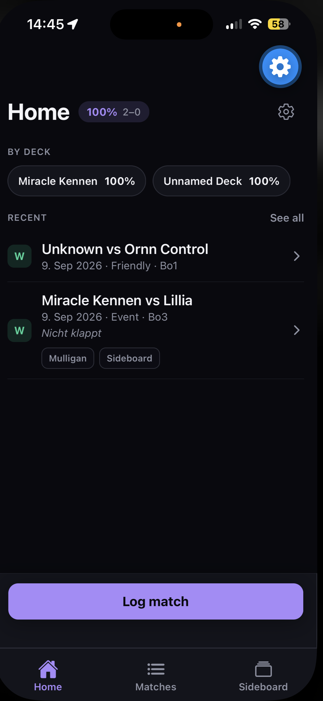
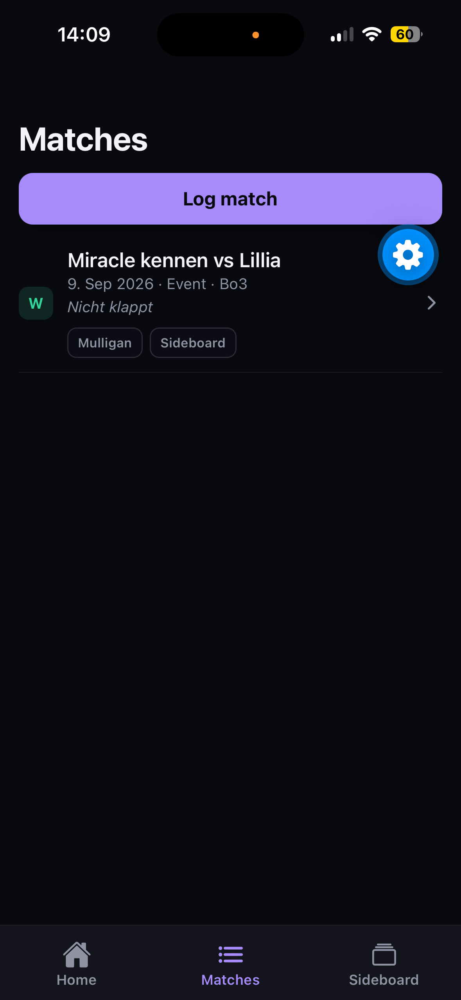
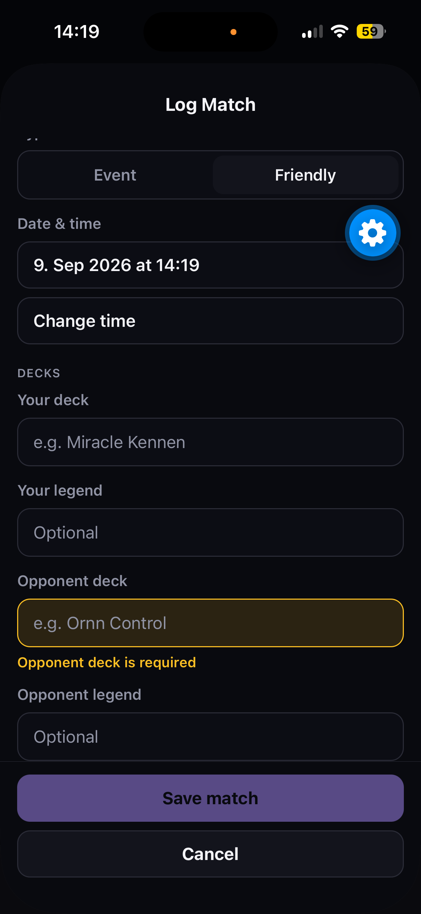
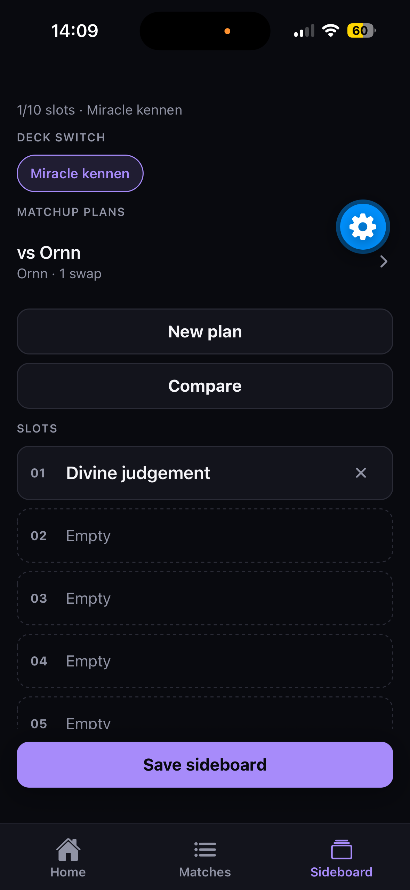

# Riftbound Companion

Personal, **local-only** companion for the **Riftbound** TCG. Journal matches, plan sideboard swaps, and check win rates on your iPhone — built with **Expo**.

No backend · no accounts · no cloud sync. Match and sideboard data stay on the device.

> Unofficial fan project. Not affiliated with or endorsed by Riot Games.

---

## Screenshots

| Home | Matches | Log match | Sideboard |
|------|---------|-----------|-----------|
|  |  |  |  |

---

## Features

- **Home** — Win-rate pill, by-deck chips, recent matches, one-tap **Log match**
- **Match journal** — Bo1 / Bo3 results, decks & legends, notes, tags (Mulligan, Sideboard, …)
- **Match detail** — Game rows, notes, sideboard compare when a plan was used
- **Sideboard manager** — Up to 10 slots per deck, matchup plans (OUT → IN), plan vs actual compare
- **Local-only** — AsyncStorage on device; Settings notes privacy + legal attribution

### Sideboard rules

- Max **10** sideboard cards  
- Swaps are **1-for-1**  
- **No sideboarding in Game 1** (UI lock)  
- Plan vs actual diff does not invent a plan you never selected  

---

## Compliance & Riot assets

Card fields are free text today. **Official Riot API card art and metadata** are planned once Developer Portal access is approved. The app does **not** ship unofficial asset packs, a digital client, monetization, or a public metagame.

**Settings** includes a privacy note and a **Legal Jibber Jabber** placeholder attribution line for Riot / Riftbound legal credit (update with the final required wording when API access is live).

Application draft for the Riot Developer Portal: [`docs/riot-application.md`](docs/riot-application.md).

---

## Run with Expo

### Requirements

- Node.js LTS  
- iPhone with **Expo Go** (App Store)  
- Same Wi‑Fi as your computer (or use tunnel mode)

### Setup

```bash
cd riftbound-companion-expo
npm install
npx expo start
```

Scan the QR code with the Camera app or Expo Go.

If LAN discovery fails (common on locked-down Wi‑Fi):

```bash
npx expo start --tunnel
```

### Smoke test

1. **Log match** — save a Bo3 with notes/tags  
2. Confirm it on **Matches** and **Home**  
3. **Sideboard** — fill slots, add a matchup plan  
4. On G2/G3, attach a plan and log actual swaps → **Compare**

---

## Scripts

```bash
npm start          # expo start
npm run typecheck  # tsc --noEmit
```

---

## Project layout

```
app/                 # Expo Router screens (tabs + match/sideboard flows)
src/components/      # UI building blocks
src/context/         # Match + Sideboard providers
src/storage/         # AsyncStorage helpers
src/theme/           # Dark palette + tokens
docs/                # Riot application text + screenshots
```

---

## Limits (MVP)

- Free-text decks/cards until Riot API card art is approved  
- On-device only — clearing Expo Go data wipes local history  
- No App Store packaging, cloud sync, or live coaching  

---

## License

See [`LICENSE`](LICENSE).
